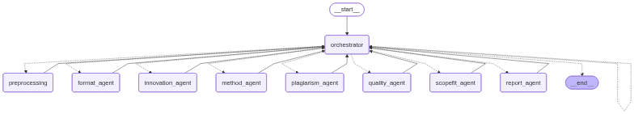

# ESDSS - Editorial Screening Decision Support System

## Overview

ESDSS (Editorial Screening Decision Support System) is an AI-powered decision support system that automates and optimizes the editorial screening process through an intelligent multi-agent architecture.

## Description

The system assists editors in efficiently and consistently evaluating submitted manuscripts by employing specialized AI agents that analyze various aspects of the screening process.

## Key Features

- **[Features]**

## Technology Stack

- **Framework**: 
- **AI/ML**: 
- **Database**: 
- **API**: 

## Installation

```bash
# Clone the repository
git clone https://github.com/[username]/esdss.git
cd esdss

# Install dependencies
pip install -r requirements.txt  # for Python
# or
npm install  # for Node.js

# Configure environment variables
cp .env.example .env
# Edit .env with your credentials
```

## Configuration

Create a `.env` file with the following variables:

```

```

## Usage
...

## Agent Architecture

The system employs the following specialized agents:

1. **[Agent Name]**: [Agent description and responsibilities]
2. **[Agent Name]**: [Agent description and responsibilities]
3. **[Agent Name]**: [Agent description and responsibilities]
4. **[Agent Name]**: [Agent description and responsibilities]
5. **[Coordinator Agent]**: Orchestrates the agents and synthesizes recommendations

### Graphstructure


### Workflow

1. Manuscript upload and metadata extraction
2. Parallel analysis by specialized agents
3. Aggregation and weighting of individual assessments
4. Generation of final recommendation with justification
5. Delivery to editorial review


## Evaluation & Metrics

- **Precision**: [Your metrics]
- **Recall**: [Your metrics]
- **Agreement with human editors**: [Your metrics]

## Contact

- **Project Lead**: Niklas Silla
- **Email**: [Email]


## Citation

If you use ESDSS in your research, please cite:

```
[Your citation format]
```